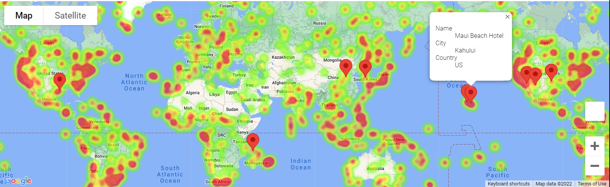

# Using Python APIs to find ideal vacation spots
Using Python requests and APIs to analyse and visualise weather data about cities around the world. Then from these cities, filtering out those that don't meet our ideal weather for a vacation, finding hotels in the remaining cities and generating a map of these using Google APIs.  
  

    

  
Before beginning, make a file named "api_keys.py" and save it in the WeatherPy folder. In it, type your OpenWeather and Google API keys in the format:
    weather_api_key = "Your API key goes here"
    g_key = "Your API key goes here"
Replace the text with your API keys and save the file.

Open WeatherPy.ipynb, found within the WeatherPy folder, clear outputs and run all cells in order. A cleaned dataset will be saved into the output_data folder, and generated figures will be saved into the Images folder.
After this, open VacationPy.ipynb, also in the WeatherPy folder, clear outputs and run all cells in order. Two maps will be generated based on the data obtained from the previously run WeatherPy file. The first is a heatmap of the humidity of the cities within the dataset, the second is the same with added pins showing hotel locations in cities with ideal vacation weather conditions, clicking on these will show more details.
